---
title:
subtitle:
layout: page
show_sidebar: false
hide_hero: true
---

[Home](../..)/[Resources](..)/Air Hockey

  

## Air Hockey
* Project 9: Air Hockey
* Student Ages: 09-14 years old
* Activity Time: 60 minutes 
* Activity Level: Beginner Coder

### Prerequisites
* Download and Installation of Kodu
* Get Started Instructions: [BBC micro:bit](microbit)
  * Connect your micro:bit to a computer via USB cable
  * Install the [mbed serial port driver](https://developer.mbed.org/media/downloads/drivers/mbedWinSerial_16466.exe)
  * Start Kodu (version 1.4.84.0 or later). It will detect your micro:bit and enable the micro:bit programming tiles.
  * [Project 1: Capture Love](capture_love)
  * [Project 2: Jump](jump)
  * [Project 3: Reach Castle](reach_castle)
      

### Learning Objectives
* Create a multiplayer Air Hockey Kodu World with BBC micro:bit Player 1 and BBC micro:bit Player 2.

### Contents
* [Design Only:Air Hockey](https://worlds.kodugamelab.com/world/vBs5DkeXQEi2Chnn3teWxA==)
* [Completed World: Air Hockey](https://worlds.kodugamelab.com/world/RgSNHPh2fkas6nTQ0WN-Aw==)
* Project: Air Hockey (BBC micro:bit Player 1, BBC micro:bit Player 2)

### Student Activities
To create a Kodu world using tiles specific the BBC micro:bit, make sure you connect a micro:bit device and install the [mbed serial port driver](https://developer.mbed.org/media/downloads/drivers/mbedWinSerial_16466.exe).

**Welcome! This activity will teach you how BBC micro:bit shake interacts with Kodu. Let's get started!**

#### Step 1: World Design

Start Kodu Game Lab. Select the New World option from the Main Menu, and Kodu Game Lab will open and display a patch of ground directly in the center of the screen.

You want to enlarge the current land to have a quality gameplay experience. You might want to make this land 27 (gray).

* **Walls** After you design a large square, then you add a parameter that surrounds the terrain. The parameter should be a unique land type that will be the wall. You might want to make this wall land 57 (purple).
* **Raise Wall** You want to raise the wall that surrounds the ground. Select the magic brush to raise the land surrounding the terrain used for gameplay. The terrain for gameplay should appear below the remaining land.
* **Center Line / Goal Outline** You need to design the hockey center line and outline the goals. You want to make this land 45 (black). You want to create the hockey center line in the direction North and South by following the compass. You want to outline the goals in the direction East and West by following the compass.
* **Goals** Finally, you want to design the hockey goals. You might want to make this land 116 (orange) and land 61 (red). You want to outline the goals in the direction East and West by following the compass. The East goal is Land Type 116 (orange) and West goal is Land Type 61 (red).

#### Step 2: Add Objects

Select the Object tool (the Kodu icon on the toolbar). With a game controller, select the Object tool using the left thumbstick.

* For mouse users, move the mouse pointer to the center of the terrain and click and release the left mouse, which open the pie menu. Use your mouse to select two (2) Saucer objects or another moving object. Move the Saucer objects in front of their respective goals. Then change the Saucer to be the same color as their goals.
* For game controller users, move the camera to the center of the terrain and press the A button, which open the pie menu. Use the game controller to select the object. Use your game controller to select two (2) Saucer object or another moving object. After adding the objects to the terrain, press button B for the Tool Menu. Move the Saucer objects in front of their respective goals. Then change the Saucer to be the same color as their goals.

You want to add the Puck object. Move the Puck to the hockey center line, which is land 45 (black).

Finally, you want to create obstacles or additional defensive players. You want to add several Stick objects. Move the Stick objects to block Puck from entering the hockey goals, which is represented by land 61 (red) and land 116 (orange).

Optional: You want to create friends to watch the air hockey game. You can add additional objects and place these objects to watch from the wall.

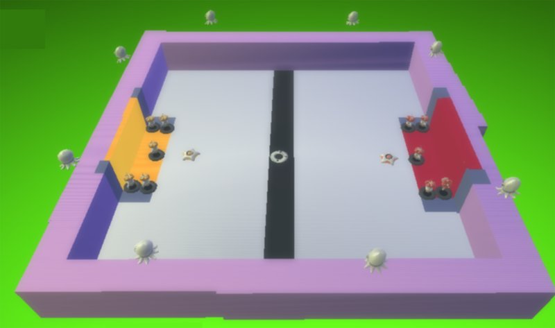

#### Step 3: Program Saucer - Move Forward

You always want Puck to move forward quickly.

#### Step 4: Program Puck - Glow

You always want Puck to glow random colors.

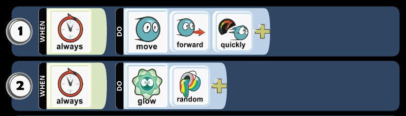

#### Step 5: Program Puck - On Land Type 45 - Move Wander

When Puck is on Land 45 (black), you always want Puck to wander quickly. Puck will always wander when it's on the hockey center line or the lines surrounding the hockey goals.

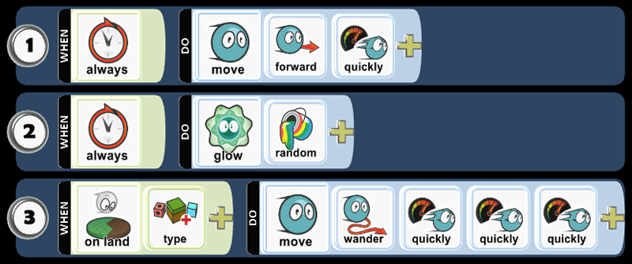

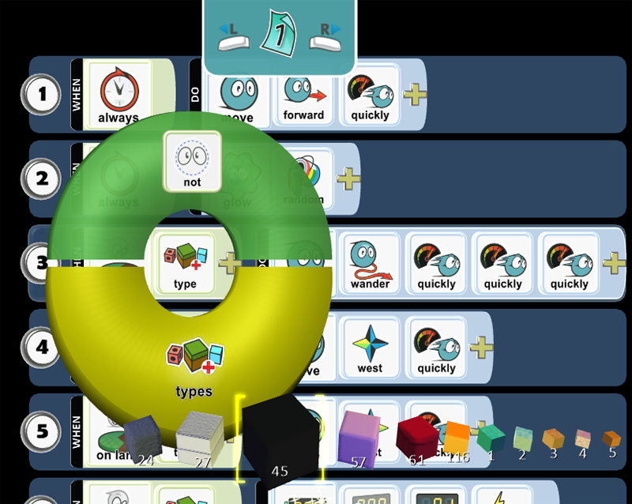

* Play Game to see if the code works as expected.

#### Step 6: Program Puck - On Land Type 116 - Move West

When Puck is on Land 116 (orange), you always want Puck to move west. Puck will always move west when it's in the orange hockey goal.

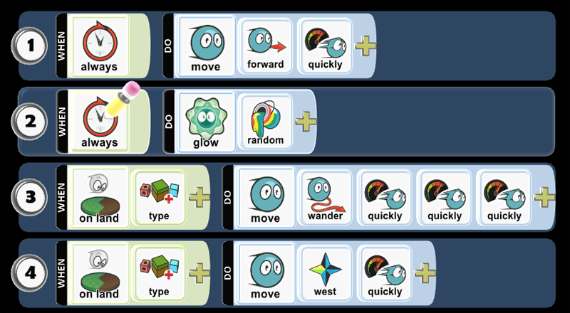

* Play Game to see if the code works as expected.

#### Step 7: Program Puck - On Land Type 61 - Move East

When Puck is on Land 61 (red), you always want Puck to move east. Puck will always move west when it's in the red hockey goal.

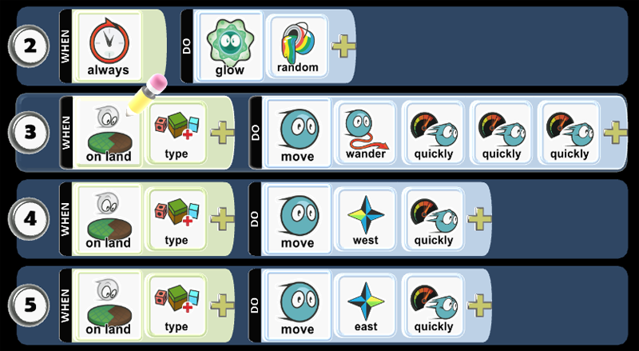

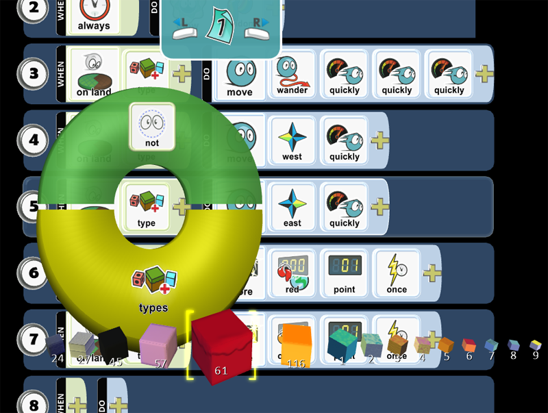

* Play Game to see if the code works as expected.

#### Step 8: Program Puck - On Land Type 116 - Score Red 1 Point

When Puck is on Land 116 (orange), you always want Puck to score Red Scoreboard 1 Point.

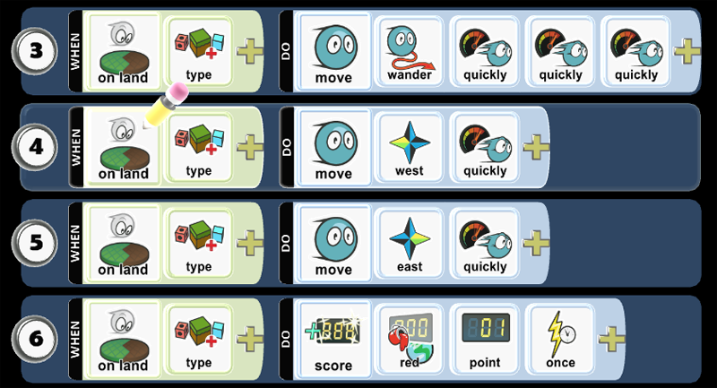

* Play Game to see if the code works as expected.

#### Step 9: Program Puck - On Land Type 61 - Score Orange 1 Point

When Puck is on Land 61 (red), you always want Puck to score Orange Scoreboard 1 Point.

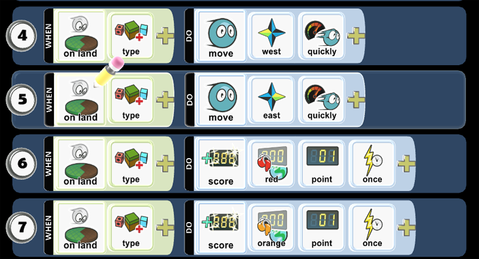

* Play Game to see if the code works as expected.

#### Step 10: Program Saucer - Player 1 - BBC micro:bit Tilt

When you have BBC micro:bit tilt, movement will be limited to North and South.

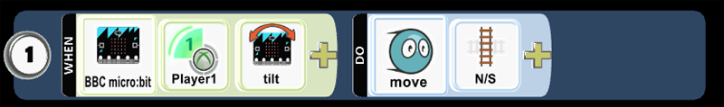

* Play Game to see if the code works as expected.

#### Step 11: Program Saucer - Player 1 - Controller L- stick

When you move the controller L-stick, movement will be limited to North and South.

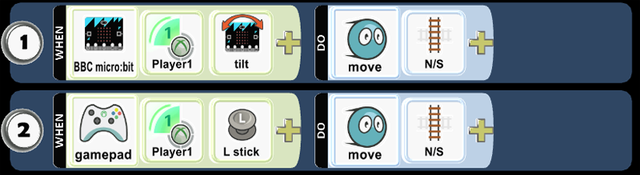

* Play Game to see if the code works as expected.

#### Step 12: Program Saucer - Player 1 - Keyboard

When you move keyboard arrows WASD, movement will be limited to North and South.

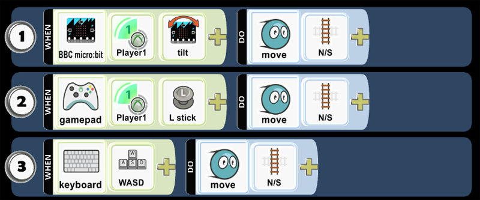

* Play Game to see if the code works as expected.

#### Step 13: Program Saucer - Player 1 - Launch Bumped Puck 

You always want Player 2 to glow red. When the Player 1 Saucer bumps the Puck, Puck will be launched.

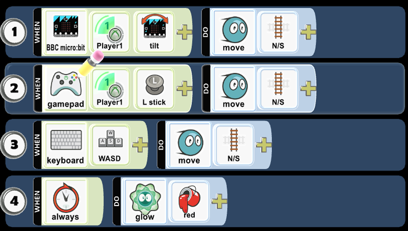

* Play Game to see if the code works as expected.

#### Step 14: Program Saucer - Player 2 - Repeat Code as Player 1 then Modify

Repeat the coding pattern from Player 1. Change the line 1 from Player 1 to Player 2. Change from WASD to UP/DOWN/LT/RT using Keyboard. Change glow from red to orange.

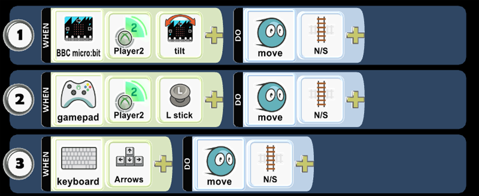

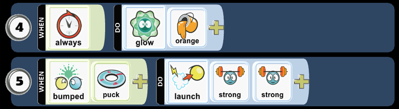

* Play Game to see if the code works as expected.

#### Step 15: Change World Settings

You want to change the following World Settings:

* Start Game With: Description with Countdown. You want to control how your game starts when you play it: Countdown will display a 3-2-1 countdown before the game begins. World Description displays the name of the world and prompts the user to press A or Enter to start playing. This uses the description you provide when you save the game.
* Score Visibility: Red. Loud will score events and animate their location in the game to the scoreboard. Labeled allows you to name the Red Scoreboard.
* Score Visibility: Orange. Loud will score events and animate their location in the game to the scoreboard. Labeled allows you to name the Orange Scoreboard.

### Skills
Character,
Citizenship,
Collaboration,
Communication,
Creativity,
Critical Thinking,
Project Based Learning

