---
title:
subtitle:
layout: page
show_sidebar: false
hide_hero: true
---

[Home](../..)/[Resources](..)/Bucket Toss

  

## Bucket Toss

* Project 4: Bucket Toss
* Student Ages: 09-14 years old
* Activity Time: 60 minutes 
* Activity Level: Beginner Coder

### Prerequisites
* Download and Installation of Kodu
* Get Started Instructions: [BBC micro:bit](microbit)
  * Connect your micro:bit to a computer via USB cable
  * Install the [mbed serial port driver](https://developer.mbed.org/media/downloads/drivers/mbedWinSerial_16466.exe)
  * Start Kodu (version 1.4.84.0 or later). It will detect your micro:bit and enable the micro:bit programming tiles.
  * [Project 1: Capture Love](capture_love)
  * [Project 2: Jump](jump)
  * [Project 3: Reach Castle](reach_castle)
* 

### Learning Objectives
* Create a Kodu World with game effects using BBC micro:bit Shake.

### Contents
* [Design Only: Bucket Toss](https://worlds.kodugamelab.com/world/zkCJkFCk5kGR46WVTovP2A==)
* [Completed World: Bucket Toss](https://worlds.kodugamelab.com/world/ivQABN6jkUa5MD5gx27Qrg==)
* [Completed Kode for Level: Bucket Toss](Bucket_Toss_Kode_for_Level.pdf)
* Project: Bucket Toss (BBC micro:bit shake)

### Student Activities
To create a Kodu world using tiles specific the BBC micro:bit, make sure you connect a micro:bit device and install the mbed serial port driver

**Welcome! This activity will teach you how BBC micro:bit shake interacts with Kodu. Let's get started!**

#### Step 1: World Design

Start Kodu Game Lab. Select the New World option from the Main Menu, and Kodu Game Lab will open and display a patch of ground directly in the center of the screen.

You want to enlarge the current land to have a quality gameplay experience. After you design a large square, then you add three squares that have unique land types to be the buckets. The land Type in this example is Land 1, 5, and 6. Finally, you want to raise the general land that surrounds the buckets. Select the magic brush to raise the land surrounding the buckets. The buckets should appear below the remaining land.

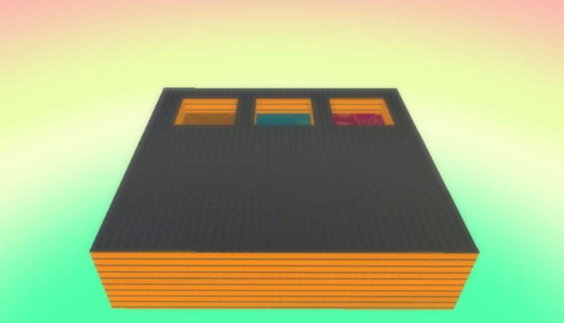

#### Step 2: Add Objects

Select the Object tool (the Kodu icon on the toolbar). With a game controller, select the Object tool using the left thumbstick.

For mouse users, move the mouse pointer to the center of the terrain and click and release the left mouse, which open the pie menu. Use your mouse to select the Kodu object or another moving object (except Rover).
For game controller users, move the camera to the center of the terrain and press the A button, which open the pie menu. Use the game controller to select the object. Use your game controller to select Kodu or another moving object (except Rover). After adding the object to the terrain, press button B for the Tool Menu.
Finally, you want to add the nonmoving objects, such as the Apple and two (2) Rocks. Change the rock colors to white and red then move the rocks to be outside the buckets.

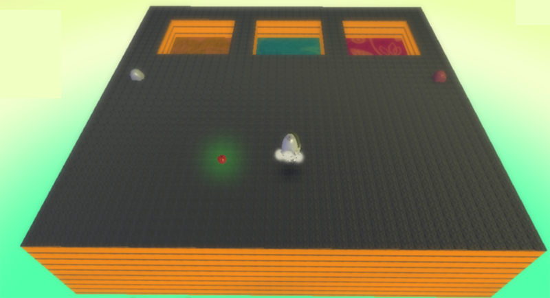

#### Step 3: Apple Creatable - Change Settings

You want to make Apple a creatable. We want to make Apple a creatable to reuse the object. Apple will respawn when it has been launched.
Using a mouse, select the object tool, the right-click on Apple then select Change Settings. You want to scroll down to Creatable option and turn it on so it turns green.
Using a wired controller, move cursor over Apple, then open Settings with B button. You want to scroll down to Creatable option and turn it on, so it turns green.

#### Step 4: Program Apple - On Land Type 5 - Score 1 Point

When the apple is on land 5 (brown terrain), Kodu will score 1 point.

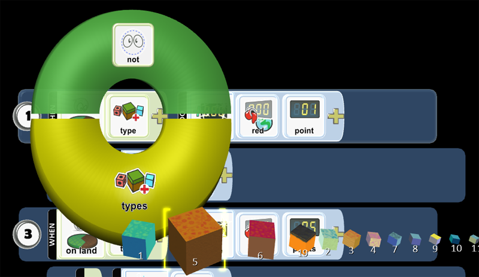

#### Step 5: Program Apple - On Land Type 5 - Vanish Me

You want to tuck programming Row 2 underneath 1 so any programming placed in 2 is always being checked for a condition that will trigger the action. Row 2 moves to the right and is a child of 1. When the apple is on land 5 (brown terrain), Apple will vanish.

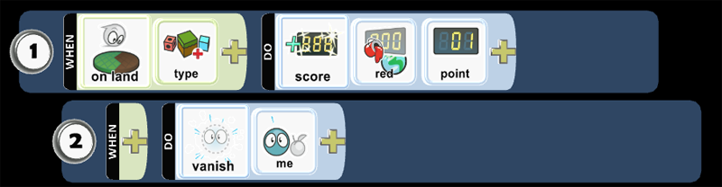

#### Step 6: Program Apple - On Land Type 1 - Score 5 Point

When the apple is on land 1 (blue terrain), Kodu will score 5 points.

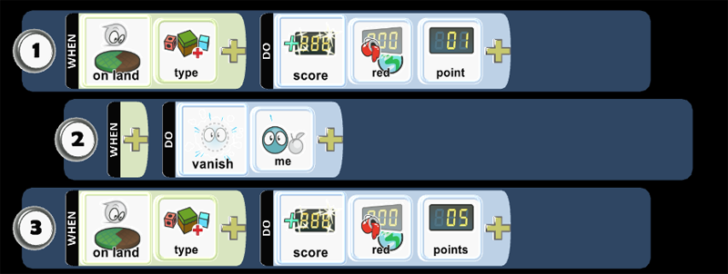

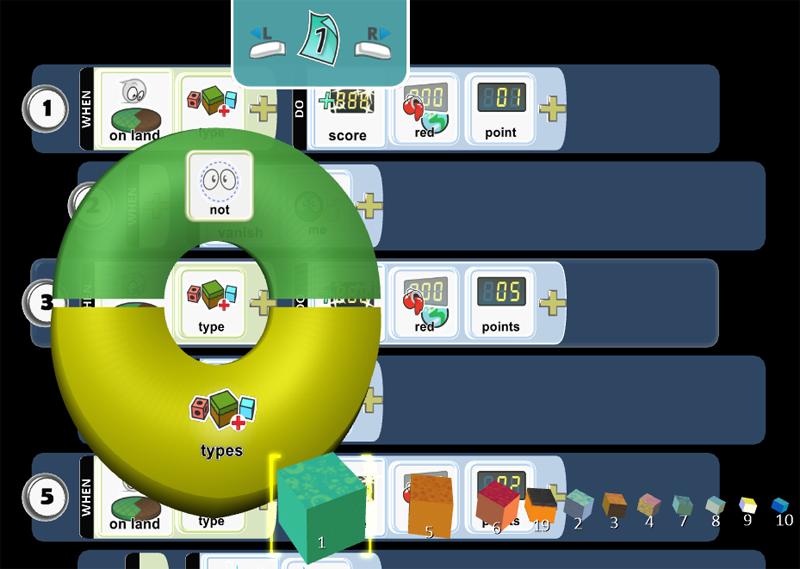

#### Step 7: Program Apple - On Land Type 1 - Vanish Me

You want to tuck programming Row 4 underneath 3 so any programming placed in 4 is always being checked for a condition that will trigger the action. Row 4 moves to the right and is a child of 3. When the apple is on land 1 (blue terrain), Apple will vanish.

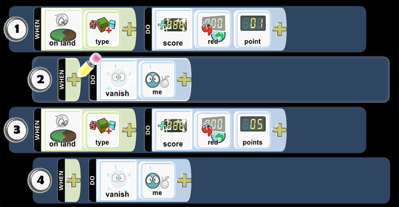

#### Step 8: Program Apple - On Land Type 6 - Score 2 Points

When the apple is on land 6 (red terrain), Kodu will score 2 points.

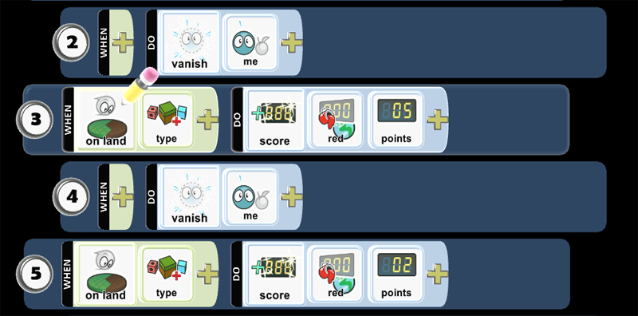

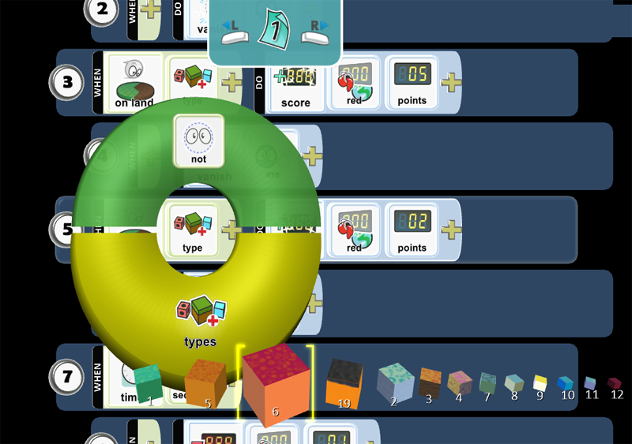

#### Step 9: Program Apple - On Land Type 6 - Vanish Me

You want to tuck programming Row 6 underneath 5 so any programming placed in 6 is always being checked for a condition that will trigger the action. Row 6 moves to the right and is a child of 5. When the apple is on land 6 (red terrain), Apple will vanish.

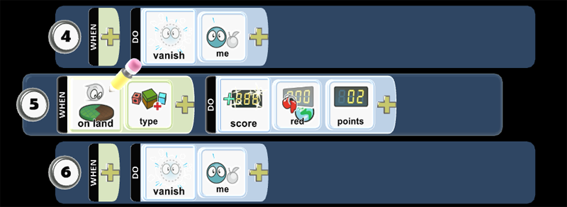

#### Step 10: Program Apple - Timer

You want to create a penalty when an Apple does not fall into a bucket. You will set a timer to 3 seconds to allow enough time for an apple to fall in a bucket.  

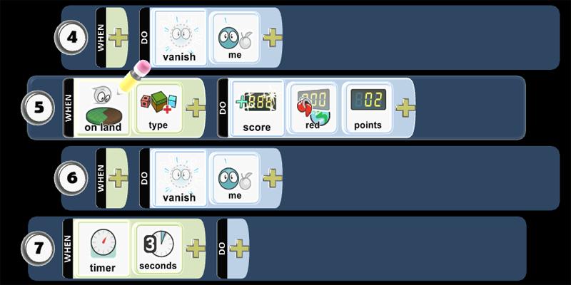

#### Step 11: Program Apple - Subtract 1 Point on Red Scoreboard

You want to tuck programming Row 8 underneath 7 so any programming placed in 8 is always being checked for a condition that will trigger the action. Row 7 moves to the right and is a child of 8. You want to create a penalty when an Apple does not fall into a bucket. When an apple is in the world without falling in a bucket, after 3 seconds, your score will reduce by 1 point.  

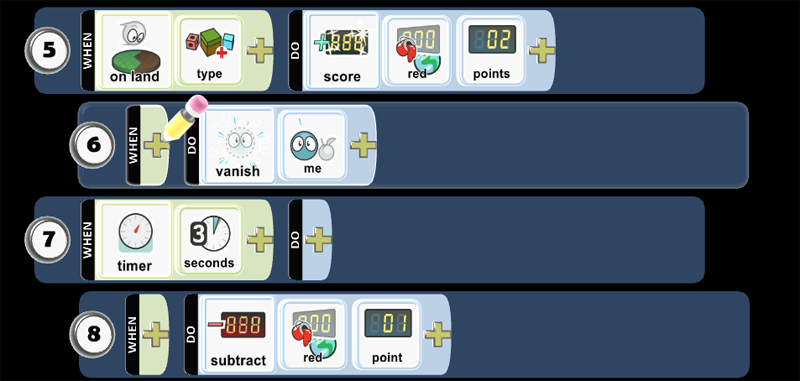

#### Step 12: Program Apple - Timer - Vanish Me

You want the apple to vanish after 3 seconds when it does not fall into the bucket.  

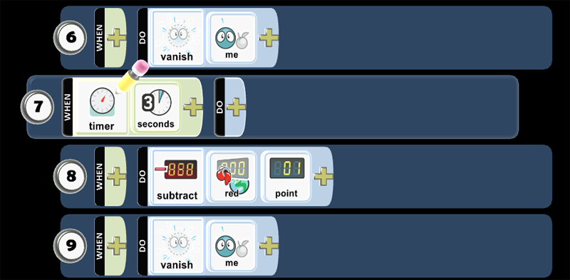

#### Step 13: Program Kodu - See White Rock - Turn

When Kodu sees a white rock, it turns towards the white rock.

* Play Game to see if the code works as expected.

#### Step 14: Program Kodu - BBC micro:bit Shake - Launch Apple

When you shake BBC micro:bit, launch a creatable apple. Apple cannot create itself, so you need to the Apple on the ground to create a new Apple when it has been launched. You will find Apple as a creatable. When the Apple has been launched in the world, then the Apple on the ground will create a new Apple to launch.

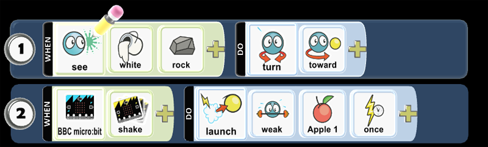

* Play Game to see if the code works as expected.

#### Step 15: Program Kodu - Mouse Left Click - Launch Apple

When you mouse left click, launch a creatable apple. Apple cannot create itself, so you need to the Apple on the ground to create a new Apple when it has been launched. You will find Apple as a creatable. When the Apple has been launched in the world, then the Apple on the ground will create a new Apple to launch.

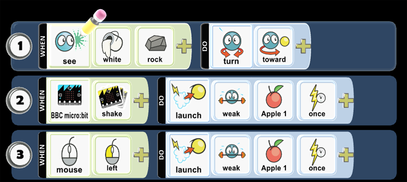

* Play Game to see if the code works as expected.

#### Step 16: Program Kodu - Wired Controller A button - Launch Apple

When you press A button on Wired Controller, launch a creatable apple. Apple cannot create itself, so you need to the Apple on the ground to create a new Apple when it has been launched. You will find Apple as a creatable. When the Apple has been launched in the world, then the Apple on the ground will create a new Apple to launch.

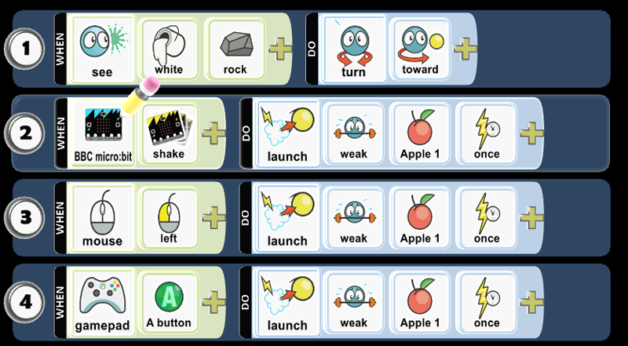

* Play Game to see if the code works as expected.

#### Step 17: Program Kodu - Timer - Switch Page 2

You want to allow Kodu to continuously turn Kodu from the red rock to the white rock. Using the Pages tool, you can change behaviors and create new scenes. Let's program the timer to switch from Page 1 to Page 2 after 1 second.

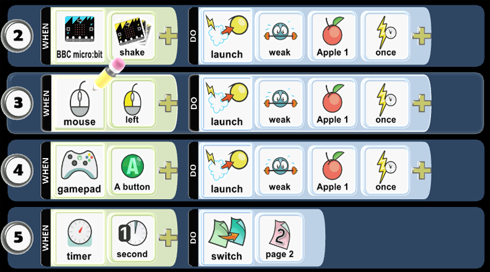

#### Step 18: Program Kodu - Copy Page

You want to copy the code from Page 1 to Page 2. You need to right-click the mouse or press button X on controller when cursor is over Page 1, then you want to copy code on the page.

#### Step 19: Program Kodu - Paste Page 1

You want to paste the code from Page 1 to Page 2. You want to mouse right-click or press thumbstick right on controller when cursor is over Page 2, then you want you will paste code from Page1 onto Page 2. You should find the code from Page 1 on Page 2.

#### Step 20: Program Kodu - Page 2 - Red Rock

You want to change the rock from white to red.

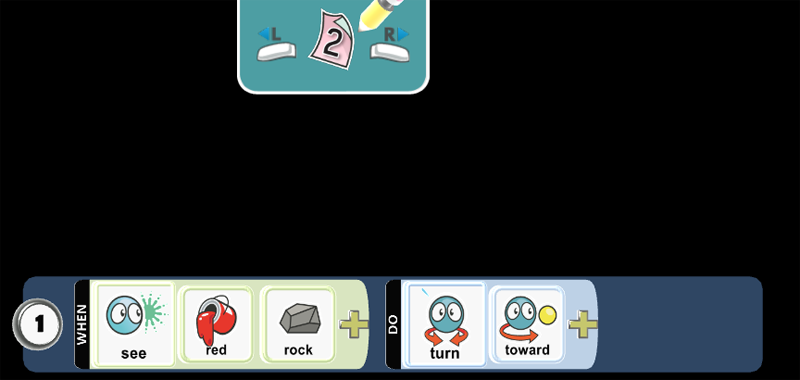

#### Step 21: Program Kodu - Page 2 - Switch Page 1

After 1 second, you want to change from Page 2 to Page 1.

* Play Game to see if the code works as expected.

#### Step 22: Change World Settings

You want to change the following World Settings:

Glass Walls (turn off). You want to remove glass walls. You want to remove the invisible barrier around the edges of the world. You want to allow apples to fall off the edge of the world.
Start Game With: Description with Countdown. You want to control how your game starts when you play it: Countdown will display a 3-2-1 countdown before the game begins. World Description displays the name of the world and prompts the user to press A or Enter to start playing. This uses the description you provide when you save the game.
Score Visibility: Red. Loud will score events and animate their location in the game to the scoreboard. Labeled allows you to name the Red Scoreboard.

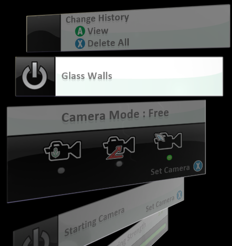

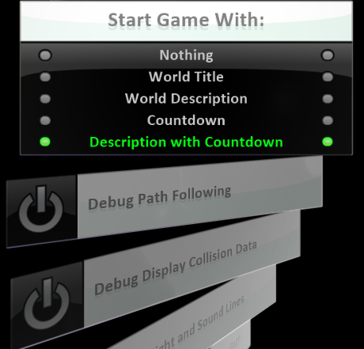

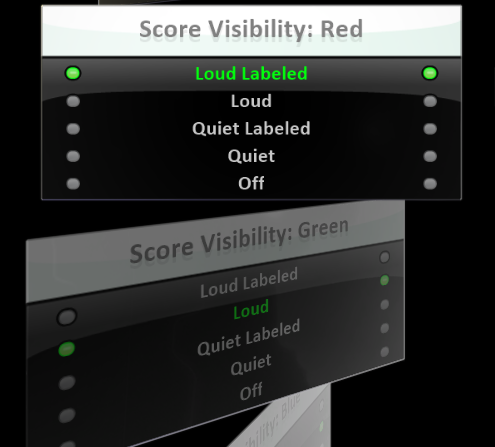

### Skills
Character,
Citizenship,
Collaboration,
Communication,
Creativity,
Critical Thinking,
Project Based Learning

