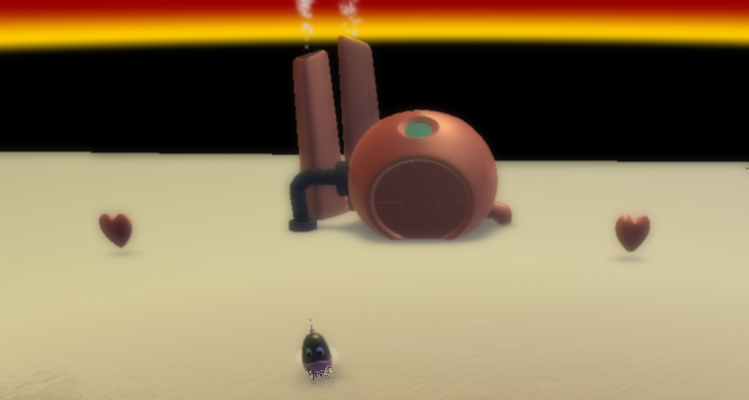
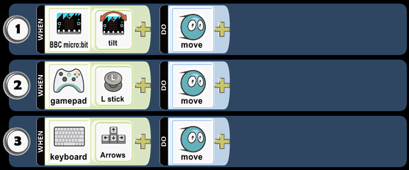
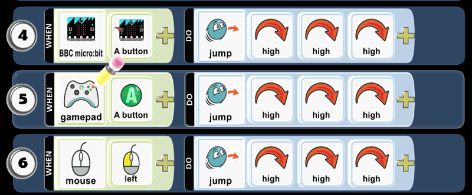
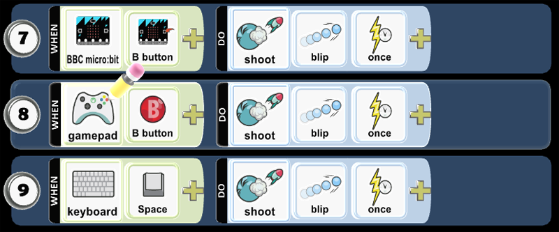
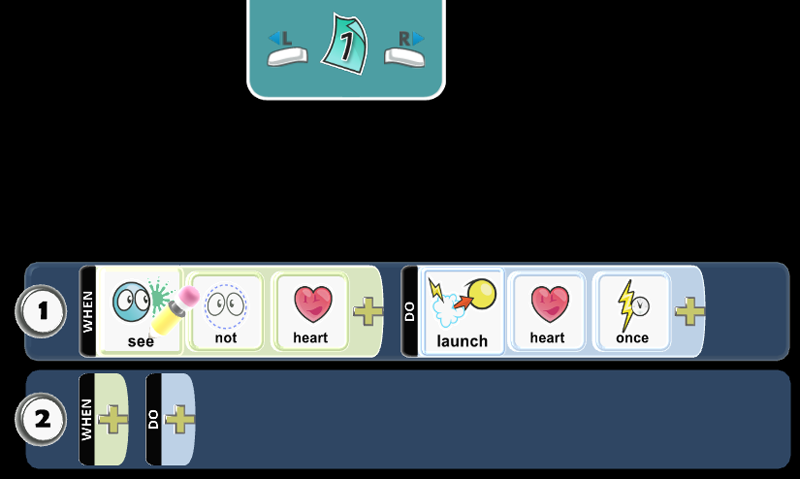
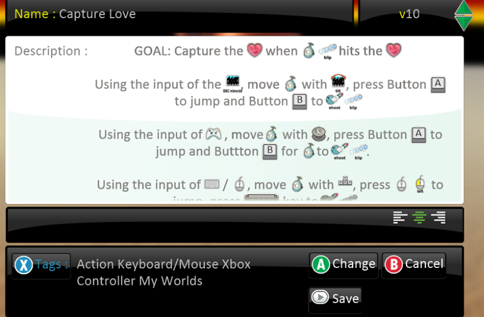
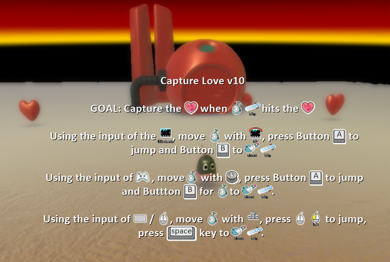

---
title:
subtitle:
layout: page
show_sidebar: false
hide_hero: true
---

[Home](../..)/[Resources](..)/Capture Love

  

## Capture Love

* Project 1: Capture Love
* Student Ages: 09-14 years old
* Activity Time: 60 minutes 
* Activity Level: Beginner Coder

### Prerequisites
* Download and Installation of Kodu
* Get Started Instructions: [BBC micro:bit](microbit)
  * Connect your micro:bit to a computer via USB cable
  * Install the [mbed serial port driver](https://developer.mbed.org/media/downloads/drivers/mbedWinSerial_16466.exe)
  * Start Kodu (version 1.4.84.0 or later). It will detect your micro:bit and enable the micro:bit programming tiles.

### Learning Objectives
* Create a Kodu World using the BBC micro:bit accelerometer and buttons.

### Contents
* [Completed World: Capture Love](https://worlds.kodugamelab.com/world/9jjISGyGsESb0A0PUmJz0Q==)
* [Completed Kode for Level: Capture Love](https://kodu.blob.core.windows.net/kodu/Resources/Capture_Love_Kode_for_Level.pdf)
* Project: Capture Love (micro:bit tilt, micro:bit button A, micro:bit button B)

### Student Activities
To create a Kodu Game Lab World using the BBC micro:bit, connect your micro:bit device, and install the [mbed serial port driver](https://developer.mbed.org/media/downloads/drivers/mbedWinSerial_16466.exe). 

**Welcome! The lesson will teach how to use micro:bit tilt and button pressed.**

#### Step 1: Add Objects

Start Kodu Game Lab. Select the New World option from the Main Menu, and Kodu Game Lab will open and display a patch of ground directly in the center of the screen.

Select the Object tool (the Kodu icon on the toolbar). With a game controller, select the Object tool using the left thumbstick. 

* For mouse users, move the mouse pointer to the center of the terrain and click and release the left mouse, which open the pie menu. Use your mouse to select Kodu or another vehicle that you like (except Rover). 
* For game controller users, move the camera to the center of the terrain and press the A button, which open the pie menu. Use the game controller to select the object. Use your game controller to select Kodu or another vehicle that you like (except Rover). After adding an object to the terrain, press button B for the Tool Menu.

Finally, you want to add two Heart objects and another non-moving object, such as a Factory. You want to increase the size of the hearts to maximum. Select the object tool, move the pointer/cursor (mouse) or control circle (game controller) over the heart until it is glowing. Using a mouse, right-click the heart then select change size. Using a game controller, move control circle over the heart then change size by pressing D-pad up and down.   

#### Step 2: Program Kodu - Move

You want to move Kodu using the BBC micro:bit.

* Using a mouse, select the Object tool and right-click the mouse on the object, Kodu. Select the Program option for Kodu. Select the When box with left-click of the mouse. 
* Using a game controller, use the Object tool and move the control circle over the object and press Y button. Press the A button on the When box.

Kodu uses the accelerometer on the BBC micro:bit. The accelerometer detects movement on the BBC micro:bit with tilt. The accelerometer detects changes in the micro:bit’s speed and detects a standard action such as tilt. You use tilt to register an event that will run when a tilt event happens. 

Alternatively, Kodu can use the L-stick on the Wired Controller or Keyboard Up/Down/Lt/Rt to move.  

* Play Game to see if the code works as expected.
  * Using a keyboard/mouse, press Esc key twice. The first Esc press will close the Programming window and the second Esc will Run the program (return to edit mode by pressing Esc).
  * Using a game controller, press button B. Then press button B to select Play Game (return to edit mode by pressing Back button). 
* Move the BBC micro:bit in any direction to observe the tilt event in action. 
* Notice the yellow light on the back of the micro:bit continuously flash yellow when the mbed serial port driver installation has been successful. The yellow light is the status LED. It will continuously flash yellow when the system is telling the user that something is happening.

#### Step 3: Program Kodu - Jump

How about using the BBC micro:bit buttons? Let's Program Kodu to jump with button pressed. When BBC micro:bit A button is pressed, Kodu jumps very high. Select the new When box in Row 2, then select BBC micro:bit and A button. Select the Do box and select jump and add high three times. You register an event handler that executes whenever an input button (A) is pressed during program execution.  

Alternatively, Kodu can use the Button A on the Wired Controller or Mouse left-click to jump.  

* Play Game to see if the code works as expected.

#### Step 4: Program Kodu - Shoot Blip

Let's add code that will run when button B is pressed! You want Kodu to shoot a blip once when button B is pressed.

Alternatively, Kodu can use the Button B on the Wired Controller or Keyboard Space key to shoot blip once.  

* Play Game to see if the code works as expected.

#### Step 5: Program Kodu - Shot Hit Heart

Let's add code that will run when the shot hits the Heart! When you shoot and hit a blip, then boom it.

* Play Game to see if the code works as expected.

#### Step 6: Program Factory - Launch Heart

You want to allow continuous gameplay for the moving vehicle, Kodu. Let's program a nonmoving object, the Factory. The nonmoving object will always see when your world is without a Heart. Let's add code that will have the Factory launch a Heart! When the Factory does not see a Heart, then the Factory will launch a Heart.

* Play Game to see if the code works as expected.

### Step 7: Save World

You want to save your work. The Game Save Screen is useful in managing the game development. You go to Home Menu then select Save my world. You want to type the game name in the Name field and describe the gameplay as well as rules of the game in the Description, then click or press Save. Finally, you want to select Change World Settings, scroll down to Start Game With, and select Description with Countdown.

* Play Game to see if the directions appear as expected.

### Skills
Character,
Citizenship,
Collaboration,
Communication,
Creativity,
Critical Thinking,
Project Based Learning

