---
title:
subtitle:
layout: page
show_sidebar: false
hide_hero: true
---

[Home](../..)/[Resources](..)/Finding Sputnik

  

## Finding Sputnik
* Project 8: Finding Sputnik
* Student Ages: 09-14 years old
* Activity Time: 60 minutes 
* Activity Level: Beginner Coder

### Prerequisites
* Download and Installation of Kodu
* Get Started Instructions: [BBC micro:bit](microbit)
  * Connect your micro:bit to a computer via USB cable
  * Install the [mbed serial port driver](https://developer.mbed.org/media/downloads/drivers/mbedWinSerial_16466.exe)
  * Start Kodu (version 1.4.84.0 or later). It will detect your micro:bit and enable the micro:bit programming tiles.
  * [Project 1: Capture Love](capture_love)
  * [Project 2: Jump](jump)
  * [Project 3: Reach Castle](reach_castle)
  * [Project 4: Bucket Toss](bucket_toss)
  * [Project 5: Twinkle](twinkle)
  * [Project 6: Underwater Explorer](underwater_explorer)
  * [Project 7: Stoplight](stoplight)
    

### Learning Objectives
* Create a storytelling Kodu world using BBC micro:bit PO and a photoresistor that effects Kodu Say and Hear.

### Contents
* [Completed World: Finding Sputnik](https://worlds.kodugamelab.com/world/1kpftkM-8EijktqMzfw8Nw==)
* Project: Finding Sputnik - photoresistor interacts with Say and Hear!

### Student Activities
To create a Kodu world using tiles specific the BBC micro:bit, make sure you connect a micro:bit device and install the mbed serial port driver

**Welcome! This activity will teach you how to control the in game Say and Hear with the micro:bit pin P0. Let's get started!**

### Make Steps
#### Materials

* BBC micro:bit, Micro USB cable
* Photoresistor 
* Crocodile clips
* Male-Male Jumper wires

#### Step 1: Jumper Cables

Connect one side of a Jumper Cable to GND on the micro:bit (usually black). Connect one side of a Jumper Cable to P0 on the micro:bit (usually red).

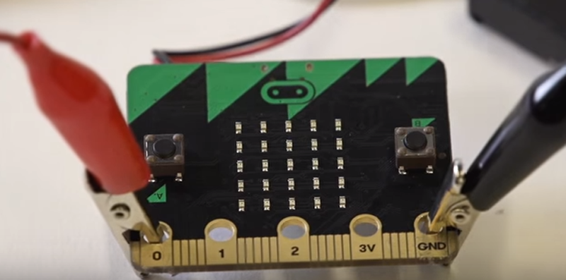

#### Step 2: Male-Male Jumper wires

Connect the other side of a Jumper Cable, usually black, to GND to the Male-Male Jumper wire. Connect the other side of a Jumper Cable to P0 on the Jumper Cable, usually red, to the Male-Male Jumper wire.

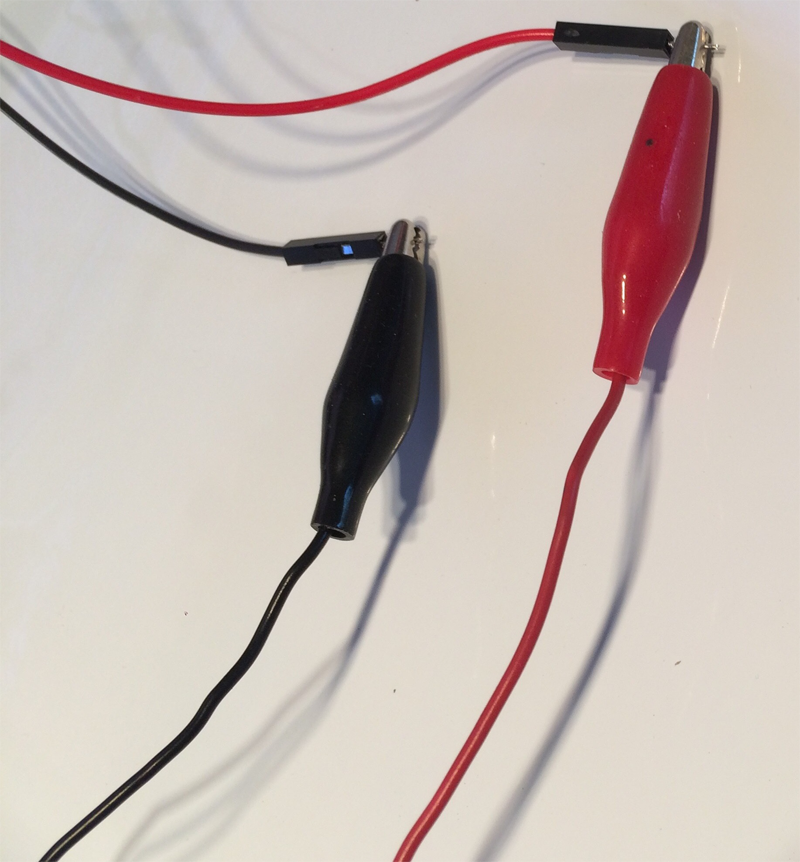 

#### Step 3: Breadboard

Photoresistor is connected to P0 (Pin 0) and Ground respectively. 

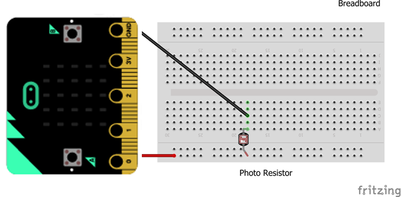

### Code Steps
#### Step 1: Add Objects - Kodu and Sputnik

Start Kodu Game Lab. Select the New World option from the Main Menu, and Kodu Game Lab will open and display a patch of ground directly in the center of the screen.

Select the Object tool (the Kodu icon on the toolbar). Move the mouse pointer to the center of the terrain and left-click, which opens the pie menu. Use the mouse to select an object, such as Kodu and a single Sputnik. You want Sputnik to be red.

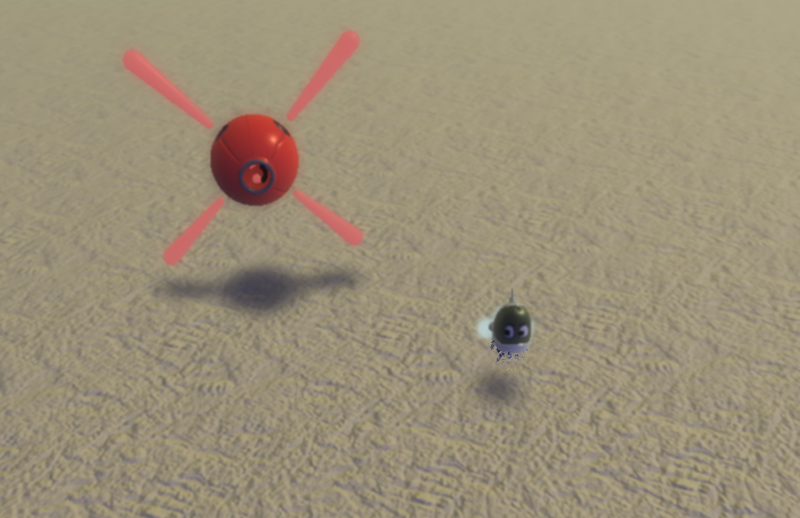

#### Step 2: Program Kodu - Set PO On

You want to Kodu to respond to the BBC micro:bit input. Let's explain the first line.

Pin 0 - Read state of BBC micro:bit pin 0.
Not - React when the when condition doesn't match.
Set Pin 1. Sets the digital output state of the pin.
On - Set the current state to on.
 

#### Step 3: Program Kodu - Initial Say

Move line 2 to be underneath line 1. This will make line 2 a child to 1. When Pin 0 is not on, the micro:bit will set pin 1 on. When the photoresistor is uncovered, it will set P1 (Pin 1) on, Kodu will say once: "Cover the photoresistor to find the correct Sputnik"

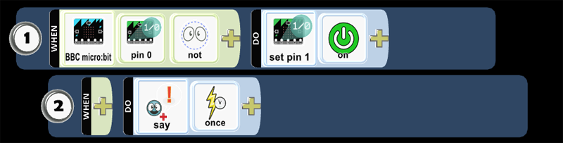

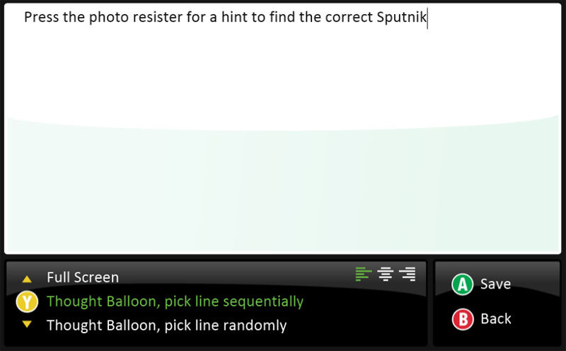

* Run your code and see if Kodu provides the message on the thought balloon. The photoresistor should remain uncovered.

#### Step 4: Program Kodu - Set P0 Off

You want to Kodu to respond to this BBC micro:bit input. Let's explain the line 3.

Pin 0 - Read state of BBC micro:bit pin 0.
Set Pin 1. Sets the digital output state of the pin.
Off - Set the current state to off.
 
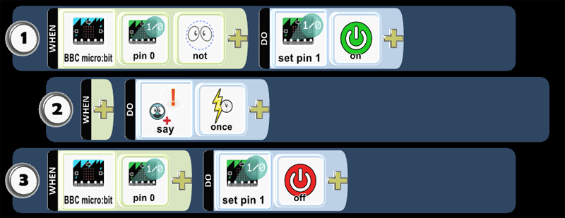

#### Step 5: Program Kodu - Prompt Say

Move line 4 to be underneath line 3. This will make line 4 a child to 3. When you set P0 off, Kodu will say: "Find Sputnik's message!'"

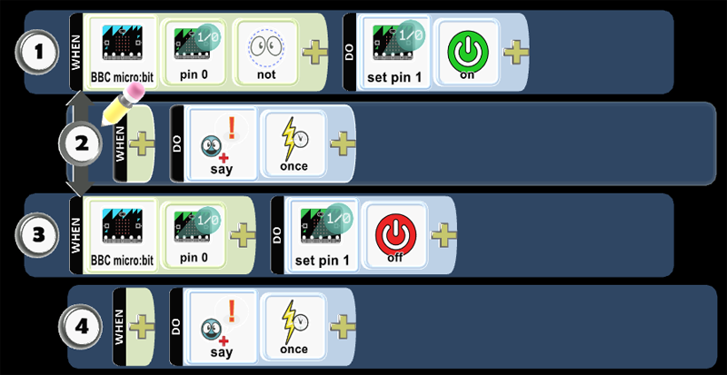

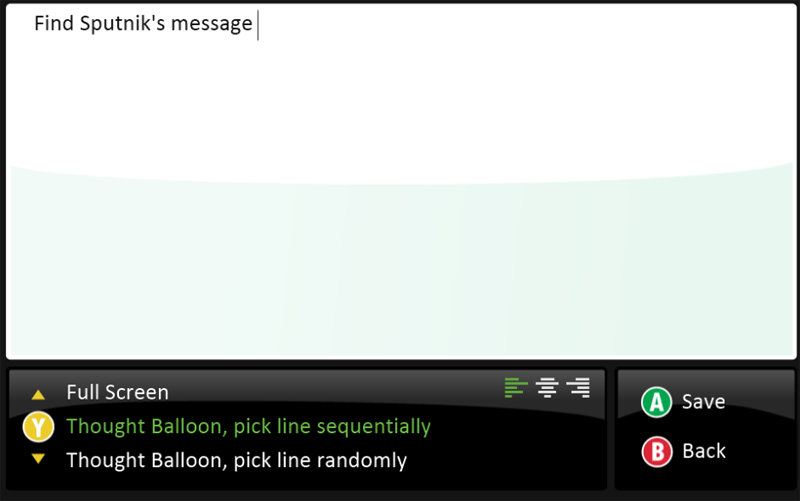

* Run your code and cover the photoresistor to see if Kodu provides the message on the thought balloon.

#### Step 6: Program Kodu - Tilt

Let's add code to have Kodu move on micro:bit Tilt.

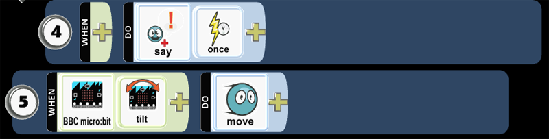

* Run the code and test that Kodu will move on micro:bit tilt.

#### Step 7: Program Kodu - Win

Let's add code to have Kodu Win when it bumped the correct Sputnik.

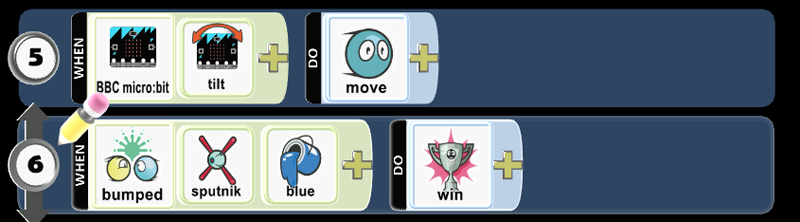

#### Step 8: Program Kodu - End

Let's add code to have Kodu Win when it bumped the incorrect Sputnik.

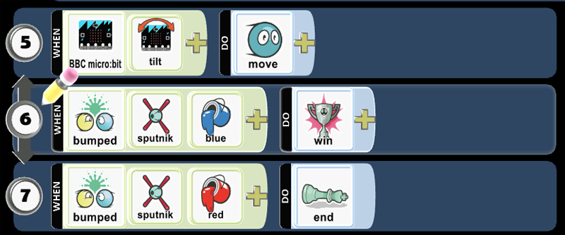

#### Step 9: Program Sputnik - Turn

Let's add program Sputnik to always turn.

#### Step 10: Program Sputnik - Hear

Let's add code for Sputnik to hear then type the message Sputnik will hear in the thought balloon. Let's add code for Sputnik to hear Kodu Say: "Find Sputnik's message". Select the option below the text to Match after I've heard

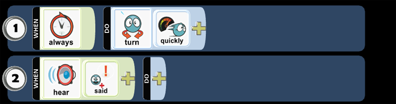

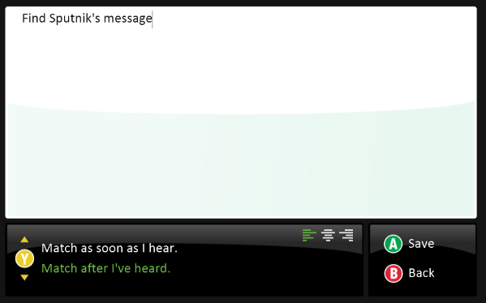

#### Step 11: Program Sputnik - Hear, Say

Move line 4 to be underneath line 3. This will make line 4 a child to 3. When Sputnik hears Kodu Say: "Find Sputnik's message", Sputnik will say "It's not' me"

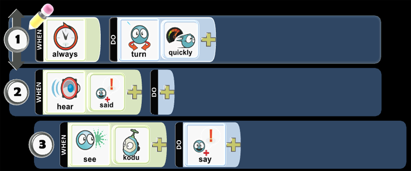

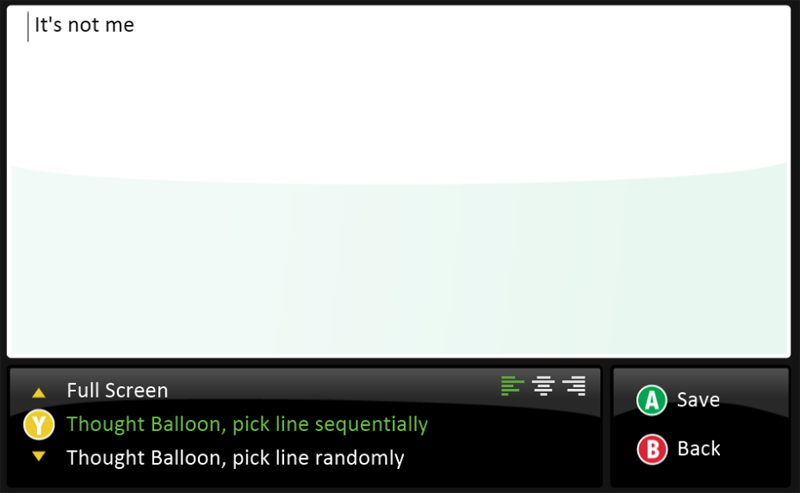

Run the code and test the program. When the photoresistor is covered, Kodu will say a message then Sputnik respond with a message.

#### Step 12: Add Objects - Clone Sputnik

Let's clone Sputnik and its code. Select the Object tool, which appears like Kodu. Move the mouse pointer over Sputnik, right-click on Sputnik, select copy. You want to move the mouse to another part of the terrain, then right-click and select Paste (Sputnik). You should repeat this process to add several Sputnik objects for the game: Finding Sputnik.

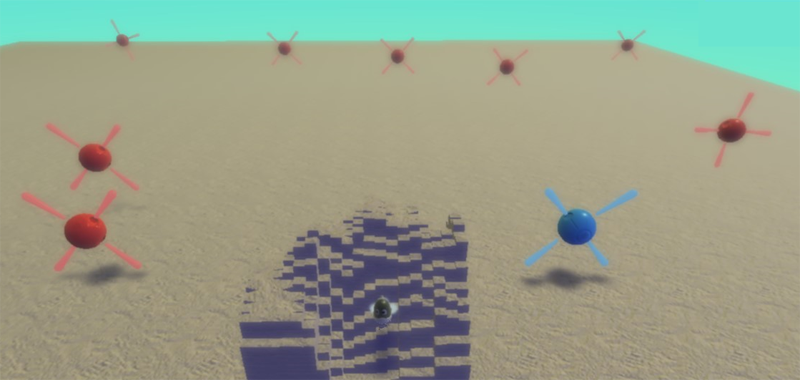

Run the code and test the program. When the photoresistor is covered, Sputnik objects will hear Kodu Say a message and respond with a message.

#### Step 13: Program Sputnik - Hear, Say

Before you program the hidden Sputnik, randomly select the hidden Sputnik. Select the object tool, move the cursor over the Sputnik object you want to modify, then left-click on the object. Let's modify Sputnik's color and its code. Select the Object tool, which appears like Kodu. Move the mouse pointer over Sputnik, right-click on Sputnik, select copy. When Sputnik has a slight glow around it, use the left or right arrow keys on the keyboard from Red to Blue. When Kodu says, "Find Sputnik's message," change the Blue Sputnik Say. Edit the last line of code, from "I'm not here" to "I'm here".

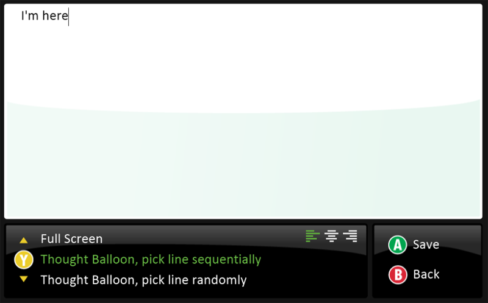

* Run the code and test the program. When the photoresistor is covered, Sputnik objects will hear Kodu Say a message and respond with a message. 

### Skills
Character,
Citizenship,
Collaboration,
Communication,
Creativity,
Critical Thinking,
Project Based Learning

