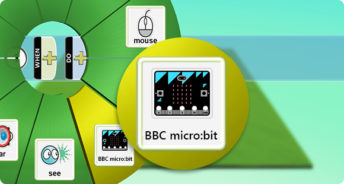
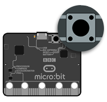
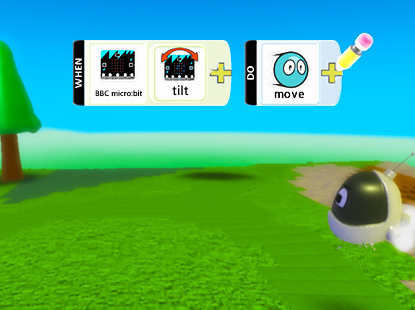
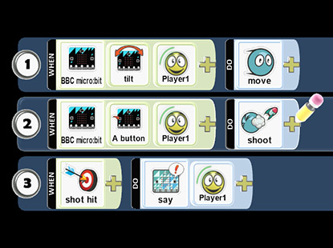
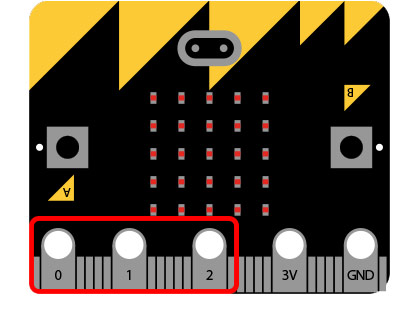

---
title:
subtitle:
layout: page
show_sidebar: false
hide_hero: true
---

[Home](../..)/[Resources](..)/BBC micro:bit

## What is a BBC micro:bit?
The [BBC micro:bit](http://microbit.org/) is a small, codable device that can be programmed to light up using a series of tiny LEDs. A friendly introduction to programming and making – switch on, program it to do something fun – wear it, customize it, develop new ideas.

## How does it work with Kodu?
We’ve given Kodu new programming tiles that allow interaction with the micro:bit. With these new tiles, you can control character movement using the accelerometer, jump and shoot with a button press, display animations and scrolling text on the screen, interface with other devices through the IO pins, and much more.

## Get Started

Connect your micro:bit to a computer via USB cable. 
Install the [mbed serial port driver](https://developer.mbed.org/media/downloads/drivers/mbedWinSerial_16466.exe).

Start Kodu (version 1.4.84.0 or later). It will detect your micro:bit and enable
the micro:bit programming tiles.

In play mode, if prompted, press the reset button on the back of
your micro:bit. If your game becomes unresponsive press
the reset button again.

## Ideas to Get You Going

  

    <h1>
      <iframe width="560" height="315" src="https://www.youtube.com/embed/4qwnOglsS3A" frameborder="0" allowfullscreen=""></iframe>
    </h1>
  

  <h3>Scroll Text on the Screen</h3>
  Kodu can scroll text across the micro:bit’s LED display. In this example, we scroll the word “SCORE!” whenever one of our shots hits something.  See how it's done in the video above.

   
  <h3>Control Character Movement</h3>
  Kodu can read the micro:bit’s on-board accelerometer using the tilt tile. In this example, we pass the accelerometer value to the move tile as a directional input, allowing you to drive the character around the world by tilting the micro:bit different directions.
  
  Note: To stop a character controlled by tilt, hold the micro:bit perfectly level.

   

   
  <h3>Shoot Projectiles</h3>
  Kodu can read the two buttons on the face of the micro:bit labeled A and B. In this example, we bind the A button to the shoot action. This enables you to shoot a stream of blips when the button is pressed.

     

   
  <h3>Multiplayer Games</h3>
  In this example we’ve taken the rules from the previous examples and put them onto a single character. Then we made one change to each rule: adding a player tile.
  
  Do this for two characters using the Player 1 and Player 2 tiles, and you have a simple multiplayer game! Kodu supports up to four connected micro:bits.

     

   
  <h3>Interface with the Real World</h3>
  The micro:bit has three general-purpose connector “pins” located along the bottom edge, labeled 0, 1, and 2. Each of these pins can serve as an input or output. What you do with these pins is up to your imagination and ingenuity.

      

## Learn More
* [The BBC micro:bit website](http://microbit.org/)
* [Microsoft Research micro:bit website](http://research.microsoft.com/microbit)
* [MakeCode for micro:bit website](https://makecode.microbit.org/)

