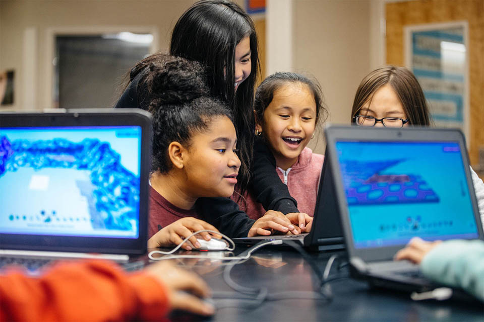

test 11

## Resources

Kodu lets kids create games on Windows PCs via a simple visual programming language. We've compiled some key resources — including training videos, sample lessons, starter worlds, and connections to other Kodu educators, to make your on-ramp as smooth as possible.

## Featured Resources:

[Applied Algebra, Geometry, and Data Collection with Computer Science](#applied) 
[BBC micro:bit and Kodu Interact](#microbit) 
[Carnegie Mellon University Curriculum](#cmu) 
[Design Process and Computer Science for Camps](#design_camps) 
[Design process and Computer Science](#design_process) 
[Game Design Course](#game_design) 
[Life Science and Ecology with Computer Science](#life_science) 
[Lynda.com Curriculum, Kodu for Kids Textbook, and connect with Kodu Teachers](#lynda) 
[PlanetKodu Classroom Kit](#planetkodu) 
[Space Science and Mars with Computer Science](#space) 
[Touch Version of Kodu Curriculum](#touch) 

## Other Resources:

[Tips and Tricks](../tips) 
[Research](#research) 
[Videos](#videos)
  

---

### Applied Algebra, Geometry, and Data Collection with Computer Science
  

Explore mathematical problems and examine relationships among data. Create and interact with objects within a three-dimensional world to study algebraic and geometric concepts.

[Lesson 1: Growing Squares](growing_squares) 
Learn to describe and analyze the pattern using math sentences and relationships when given incremental changes in the area of a square.

[Lesson 2: Length, Width, Area, and Perimeter](length_width_area_and_perimeter) 
Learn to create a three-dimensional object from two-dimensional representations when given the length, width, and height measurements for quadrilaterals.

[Lesson 3: Area, Perimeter, and Volume](area_perimeter_and_volume) 
Learn to describe the property with the appropriate standard units when given a measure of length, width, height, surface area, perimeter, and volume. 

[Lesson 4: Surface Area and Volume](surface_area_and_volume) 
Learn to describe the change as a fraction of the original shape when given a change to a shape.

[Lesson 5: Obstacle Course](obstacle_course) 
Learn represent the situation, analyze the resulting data, and display the data in a table or graph when given a scenario.

[Lesson 6: Placing and Programming Items](placing_and_programming_items) 
Learn to represent an object as a three-dimensional shape in a coordinate plane when given an object’s properties such as length, width, height, surface area, volume, and location. 

[Lesson 7: Timing and Winning](timing_and_winning) 
Learn to plot and model the shortest paths between the locations using a computer simulation when given multiple target locations and obstacles.

[Lesson 8: Double the Items](double_the_items) 
Learn to design an investigation to determine the effect on the time it takes to complete the retrieval of the items when given an increase in target items.

[Lesson 9: Data](data) 
Learn to sample a population to collect performance data on the task.

[Lesson 10: Showcasing Creativity](showcase_experience) 
Learn to collect data, analyze it, and report your findings.

---

### BBC micro:bit and Kodu Interact
  

Kodu programming tiles allow interaction with the micro:bit. The user can control character movement using the accelerometer, jump and shoot with a button press, display animations and scrolling text on the screen, and interface with other devices through the IO pin

[Resource. BBC micro:bit and Kodu](bbc_microbit/microbit) 
Learn programming tiles that allows Kodu and the BBC micro:bit to interact.

[Project 1: Capture Love](bbc_microbit/capture_love) 
Create a Kodu World using the BBC micro:bit accelerometer and buttons, wired controller, or keyboard/mouse.

[Project 2: Jump](bbc_microbit/jump) 
Create a multi-player Kodu World using the BBC micro:bit, wired controller, or keyboard/mouse for Player 1 and Player 2.

[Project 3: Reach Castle](bbc_microbit/reach_castle) 
Create a Kodu World with game effects using the BBC micro:bit Show Pattern and Pattern.

[Project 4: Bucket Toss](bbc_microbit/bucket_toss) 
Create a Kodu World with using the BBC micro:bit shake, wired controller, or keyboard/mouse. 

[Project 5: Twinkle](bbc_microbit/twinkle) 
Create a complex Kodu World with game effects using the BBC micro:bit Show Pattern and Pattern.

[Project 6: Underwater Explorer](bbc_microbit/underwater_explorer) 
Create a storytelling Kodu world with using the BBC micro:bit, Say and Hear.

[Project 7: Stoplight](bbc_microbit/stoplight) 
Create a Kodu world to control the Sky in game using the BBC micro:bit PO and P1 on the BBC micro:bit and a photo-resistor.

[Project 8: Finding Sputnik](bbc_microbit/finding_sputnik)  
Create a storytelling Kodu world using the BBC micro:bit PO and a photo-resistor that effects Kodu Say and Hear.

[Project 9: Air Hockey](bbc_microbit/air_hockey)  
Create a multi-player Kodu world using the BBC micro:bit, wired controller, or keyboard.

---

### David S. Touretzky of Carnegie Mellon University Curriculum
 

Carnegie Mellon University Kodu Curriculum helps explain the observed program behavior in terms of the code and the “laws” of computation. Also, the curriculum helps predict program behavior from the code. Finally, the curriculum helps construct programs by applying design patterns and computational principles. [See more of David's Kodu Resources for Teachers](https://www.cs.cmu.edu/~dst/Kodu).

[Module 1: Kodu intro; Eating apples in the Kodu world](eating_apples) 
Learn to navigate through a world by learning programming tiles and the rule editor.

[Module 2: Color Filters with Pursue and Consume](color_filters) 
Learn programming tiles using the color filter "see" and "bumped" as well as "grab" actions to pick up an object.

[Module 3: Indentation and scores; Do Two Things and Count Actions idioms](indentation_and_scores) 
Learn programming tiles using "eat" "score" "boom", and "give" actions. 

[Module 4: Rule Ordering and Default Value](rule_ordering) 
Learn how rule order can be used to establish default values for an action.

[Module 5: State machines; Show Page As Color idiom](state_machines)  
Learn to create programs with multiple pages as well as state machine diagrams to represent complex programs.

[Module 6: Basic paths; Follow the Yellow Brick Road idiom](basic_paths) 
Learn to create multiple paths as well as program characters with the "say" action and to follow a path.

---

### Design Process and Computer Science for Camps
 

Kodu Makerspace is a four-day camp of two hours per day. The camp series will explore the design process and cover skills needed to create worlds and games with Kodu Game Lab.

[Session 1: Exploring Kodu Characters](exploring_kodu_characters) 
This is a two-hour camp in which students will explore Kodu Game Lab by playing and then examining the character and action sequences of two games.

[Session 2: Exploration and Modifying](exploration_and_modifying) 
This is a two-hour camp in which students will take their first steps in creating game action with When… Do… programming constructs in a tutorial to create a more complex game.

[Session 3: Collaborative Game Development](collaborative_game_development) 
This is a two-hour camp in which students will begin transforming their game plans into a working game using the techniques they learned in Sessions 1 and 2.

[Session 4: Presentation of Game Development](presentaion_of_game_development) 
This is a two-hour camp in which students will finalize their games by incorporating ideas from the feedback session and adding directions for the user.

---

### Design process and Computer Science
 

Kodu Makerspace is a unit of eight, 50-minute lessons. The unit will explore the design process and computer science skills needed to create worlds and games.

[Lesson 1: Managed Test Drive](managed_test_drive) 
Learn to load and play a Kodu game as well as navigate the menus associated with characters.

[Lesson 2: Guided Investigation](guided_investigation) 
Learn coding and game development with a focus on character action and introductory programming concepts.

[Lesson 3: Exploring Developer Experience, part 1](exploring_developer_experience_part_1) 
Learn to play a more complex game and follow along with a demonstration to modify the characters and the action.

[Lesson 4: Exploring Developer Experience, part 2](exploring_developer_experience_part_2) 
Learn to develop a collaborative project to revise one of the Kodu games students have worked with during the past three lessons.

[Lesson 5: Creative Collaboration](creative_collaboration) 
Learn to transform game plans into a working game using the techniques they learned in lessons 1 through 4.

[Lesson 6: Open-ended Developer Experience, part 1](open_ended_developer_experience_part_1) 
Learn to share the first draft of a game, gather feedback, and assess the feedback for consideration in the next draft of the game.

[Lesson 7: Open-ended Developer Experience, part 2](open_ended_developer_experience_part_2) 
Learn to finalize a game by incorporating ideas from the feedback session and adding directions for the user.

[Lesson 8: Showcase Experience](showcase_experience) 
Learn to a Gallery Walk for peers, teachers and other guests as well as reflect on the coding experience.

---

### Game Design Course
  

Game Design Course is a self-learning, self-paced “Game Design” course, designed to run through five weeks.

[Week 1: Getting Started with Kodu](getting_started_with_kodu) 
Learn about Game Making with Kodu Game Lab and the informal process of game design.

[Week 2: Rapid Prototyping](rapid_prototyping) 
Learn about rapid prototyping by brainstorming, identifying risks, design patterns, and Kodu Game Lab Recipes.

[Week 3: Game Mechanics](game_mechanics) 
Learn about Game Mechanics - designing challenge and engagement.

[Week 4: The Game Experience](game_experience) 
Learn to develop a Game Experience: Theme and Story.

[Week 5: Pushing the Boundaries](pusing_the_boundaries) 
Learn about Pushing the Boundaries - Game of skill and chance using puzzles and probability.

---

### Life Science and Ecology with Computer Science
  

"Water All Around Us" provides lessons themed around water and designed explore the ways in which water connects humans, animals and weather within ecosystems.

[Lesson 1: Play: Water all around us](water_all_around_us) 
Explore the important role that water plays in underwater animal ecosystems through the lens of the life of a cybersalmon (a Kodu style North American Sockeye Salmon)

[Lesson 2: Remix: Water connects us all](water_connects_us_all) 
Present a game world for players to observe as well as create their own salmon run game.

[Lesson 3: Create: Water Cycle Model](water_cycle_model) 
Construct a model showing the relationship that exists between bodies of water, currents, temperature, and weather patterns.

---

### Lynda.com Curriculum, Kodu for Kids Textbook, and connect with Kodu Teachers
 

Kodu can be taught by any teacher without any previous coding experience. Outside resources provide training videos, lesson plans, and starter worlds for educators, administrators, and students. |External References Only]

[Lynda.com Kodu Curriculum](https://www.lynda.com/search?q=kodu)
Learn how to add objects and characters; introduce game logic with Kodu's When/Do menus; and use properties like lighting, water, trees, and movable cameras. Lynn also covers advanced object-programming and property concepts, such as adding sounds, scoring, and titles to your game.

[Kodu for Kids](https://www.amazon.com/Kodu-Kids-Official-Guide-Creating/dp/0789750767) 
Kodu for Kids teaches you all you need to know to create great Kodu games that you can share with the world! Learn four start-to-finish example games for 1-Player Shooter; 2-Player Competition; Mission Quest; and Side-Scroller Experience.

[Kodu Classroom Curriculum](https://koduclassroom.co.uk/)
Learn to teach Kodu Basics; build a Mario Kart Kodu; deliver a Kodu Game Design Day; and use Kodu as a storytelling device.

[Microsoft Educator Community](https://education.microsoft.com/#%7B%22TagCategories%22%3A%22%2C1190%2C%22%7D)
Network with other Kodu Teachers. Learn about additional Kodu resources available written by the teacher, for the teacher.

---

### PlanetKodu Classroom Kit
  

---

### Space Science and Mars with Computer Science
  

---

### Touch Version of Kodu Curriculum
 

---

## Videos

---

## Research

