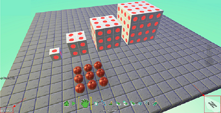

test 25

[Home](..)/[Tips](.)/Coordinates and Snap-to-Grid

 

## Coordinates
Coordinates numerically represent a cursor's location in a Kodu world. The coordinates are based on a grid where two lines or axes intersect at the origin point. 

the X-axis indicates the cursor's distance east (positive) or west (negative) of the origin point— the longitude
the Y-axis indicates the cursor's distance north (positive) or south (negative) of the origin point—the latitude
Coordinates
When editing a Kodu world, press F3 to display the coordinates of your cursor. Coordinates will show at the bottom left corner of the screen. The compass is in the bottom, right corner.

## Snap-to-Grid
In addition to showing the coordinates, F3 also enables the snap-to-grid functionality for placing objects.  This is even more useful than seeing the coordinates so it should be called out.  It also causes the terrain raising and lowering to happen in 1-unit increments instead of in a smooth, continuous manner.

## See also
Re-center Camera, Print Kode, Screenshots 

Lessons
Growing Squares, Surface Area and Volume, Placing and Programming Items, Data

## Questions?
For questions or any support issues, email <KoduSupport@InfiniteInstant.com>.
 

 

   

