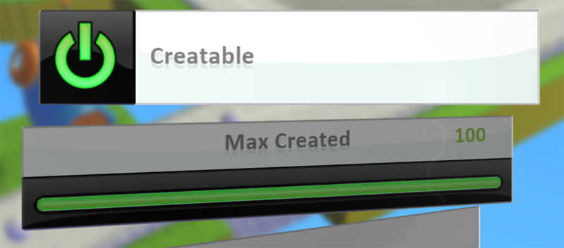
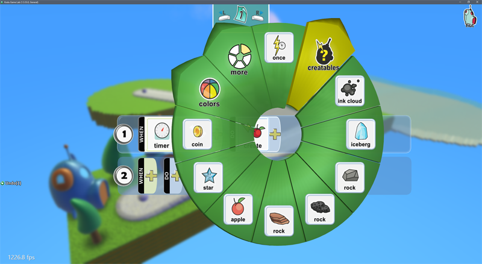
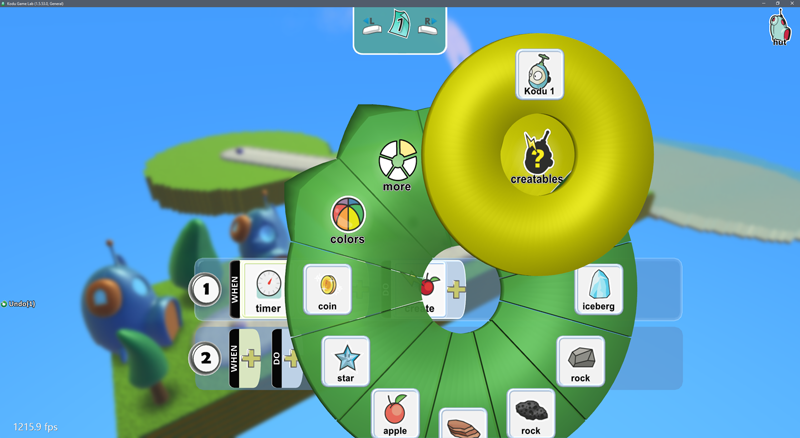
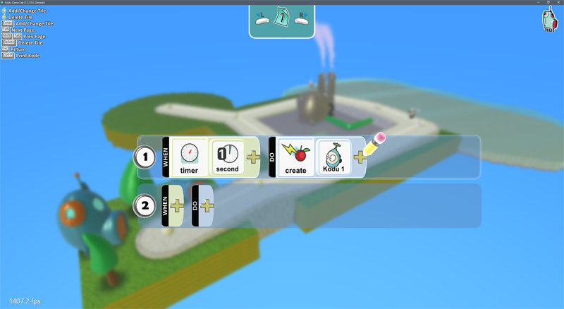

[Home](..)/[Tips](.)/Creatables

## Creatables

Creatable characters are one of Kodu's most powerful features.  Creatables can be programmed just like any other character.  The difference is that they don't exist when you start your game.  Instead, they are spawned by other characters as needed in the game.  Working with creatables is a multi-step process.  Here's how it goes:

1. Create the character you want to spawn and add its programming.
2. Right click on the character and choose Change Settings.
3. Scroll down to find the Creatable setting and turn it on.

Notice that as soon as you do this, the Max Created setting also appears.  As the name suggests, this allows you to limit the number of this character existing at any one time.  

For this example I've create a Kodu called **Kodu 1** and marked it as a creatable.  Next we need to program another character to spawn **Kodu 1** while the game is running.  I'll program a hut for this.

4. Now that you have a character marked as **creatable** you will notice that a new sub-menu will appear when using the Create tile.  

Click on this and it will let you choose from the characters you have marked as creatable.

In this case we are programming the hut to spawn a new **Kodu 1** every second.

When you run this, the glowing green glowing Kodu will disappear.  Creatables only show up in the game when they are spawned.  The hut programming will cause it to start spawning a new Kodu every second.

## See Also
[Print Kode](print_kode), [Start Game With](start), [Score Visibility](score_visibility)

## Questions?
For questions or any support issues, email <KoduSupport@InfiniteInstant.com>.
 

 

   

