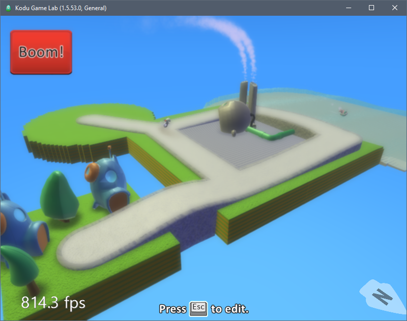
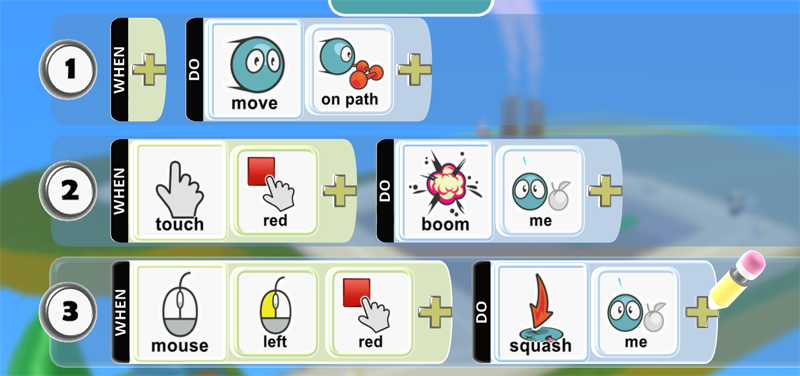
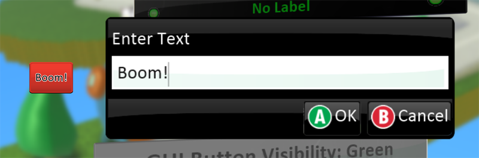

[Home](..)/[Tips](.)/GUI Buttons

## GUI Buttons

"GUI" stands for "Graphical User Interface".  The GUI Buttons are buttons you can use to add more control options to your game.  Kodu's buttons can be activated by both Touch and Mouse. Here's what one looks like in the game:

Buttons are automatically added to your game when they are referenced by any programming.  For instance, in this example the cycle is being programmed to explode if the button is touched and get squashed if the button is clicked with the left mouse button.

## Labels

By default, the buttons are added without labels.  To add a label to your buttons go to the world settings. 
 
Scroll down and find the GUI Button Visibility section and enter a label for your button.

## See Also

[Secret Glyph Codes](glyph), [Score Visibilty](score_visibilty)

## Questions?
For questions or any support issues, email <KoduSupport@InfiniteInstant.com>.
 

 

   

