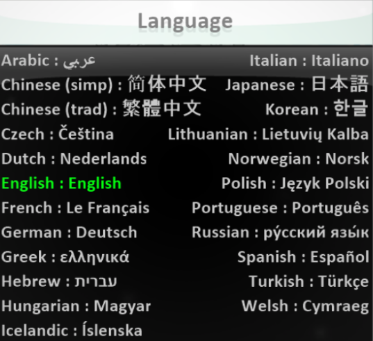

27

[Home](..)/[Tips](.)/Language

The languages menu can be found by selecting **Options** from the **Main Menu**.

After selecting a new language you will need to restart Kodu to have the new language appear. 

## Kodu Translations
Kodu's translations are done by our community. Since we don't have staff to handle the translations, they do go out of date as Kodu changes.  If you'd like to help translate Kodu into your language or improve an already existing translation please email <KoduSupport@InfiniteInstant.com> for more information.

## See also
[Print Kode](print_kode), [Screenshots](screenshot) 

## Lessons
Creating timing and score screen capture in Kodu (Hebrew) |  Complex character behavior in Kodu (Hebrew) |  Creatables in Kodu (Hebrew)   

## Questions?
For questions or any support issues, email <KoduSupport@InfiniteInstant.com>.
 

 

   

