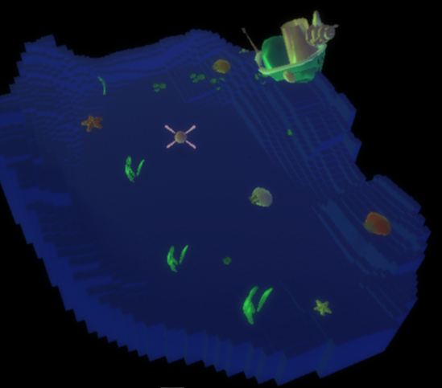
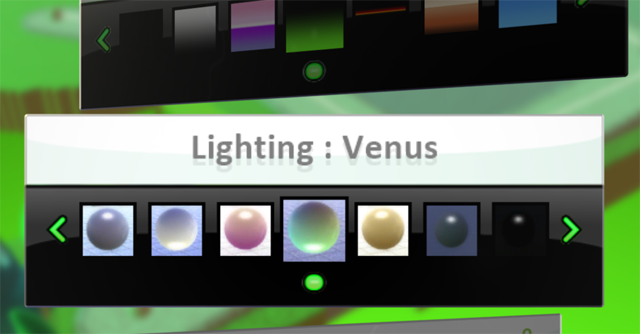

[Home](..)/[Tips](.)/Lighting

Use the lighting settings to set the mood for your game, control day and night, or compliment your game's location.

The lighting control is found in the World Settings menu which is on the far right when you are editing your world.  

Scroll down to find the Lighting Settings control and set the value you want. 

For the best effect, experiment with combining different lights and sky combinations.

## See Also
[Sky](sky), [Start Game With](start)

## Questions?
For questions or any support issues, email <KoduSupport@InfiniteInstant.com>.
 

 

   

