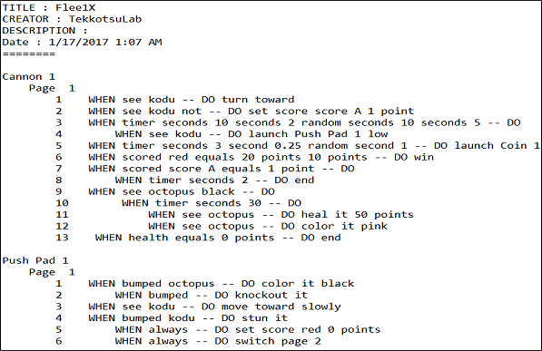

[Home](..)/[Tips](.)/Print Kode

## Print Kode

When you choose Print Kode from the Home Menu the standard Windows print dialog is displayed allowing you to send the kode to your printer.  The printed format of the kode is compact making it ideal for quickly scanning all the programming in a level.

The Print Kode option from within the Kode Editor only prints the kode for the character currently being edited, not the whole world.

### Print to File

As part of the print process, the kode is first written to a text file in the folder Documents\SavedGames\Boku.  The filename will be Kode0000.txt where the 0000 is incremented for each printing.  This file is created before the print dialog is displayed, so, if you cancel out of the print dialog, the file is still created.  This can be useful for sending in email or reviewing for assignments. 

## Interpreting the Kode

Your program name, version number, and current date are included in the printout. Each object (Push Pad 1, Cannon 1) will have the code explained using When/Do. The image shows for the code for the first few objects in the Flee1X world. The project was created by TekkotsuLab on January 17th, 2017. 

## See Also
[Language](language), [Screenshots](screenshots)

## Questions?
For questions or any support issues, email <KoduSupport@InfiniteInstant.com>.
 

 

   

