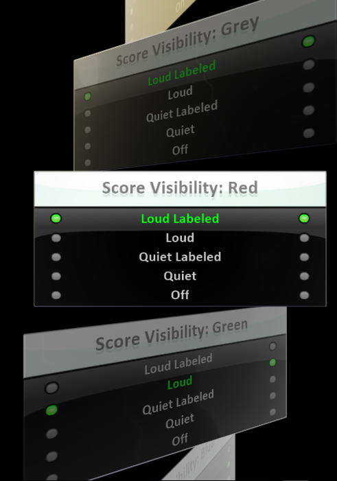

[Home](..)/[Tips](.)/Score Visibility

## Scores

Within Kodu there are three different sets of scores available for use in your programming.  There are the **colored scores** referred to by their color, **world scores** named A-Z, and **private scores** named a-z.

The **colored scores** and the **world scores** are all public.  They are shared by all characters in the world so any character may access or change them.  This is the equivalent of them being global variables.

The **private scores** are unique to each character.  Each character has their own set of **private scores** which cannot be accessed by other characters.  This is equivalent to private variables.

The **colored scores** are special in that they can be displayed on the screen while the game is playing.  They only get displayed if at least one character refers to them in the characters kode.  How they are displayed is controlled by the Score Visibility.

## Score Visibility

Score Visibility controls how prominent the display will be for scoring events. Score Visibility has five options: Loud Labeled, Loud, Quiet Labeled, Quiet, and Off.  

* **Loud** -- The score is display on screen.  When the score changes, the new value floats up from the character which changed the score. 
* **Quiet** -- The score is displayed on screen but no effect is done when the score changes.
* **Off** -- The score is not displayed on screen.

The labeled versions of Loud and Quiet allow you to add a short text label to the scores as seen in the picture above. 

By default, the score visibility is set to Loud.

## How to Change Score Visibility

Inside your game, select World Settings (bottom, far-right icon). Scroll down the list until you find the Score Visibility tiles for each of the colored scores.  If you select one of the labeled options, you will be prompted to type in the label for the score.

## Questions?
For questions or any support issues, email <KoduSupport@InfiniteInstant.com>.
 

 

   

