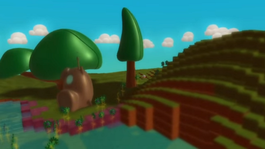

[Home](..)/[Tips](.)/Screenshots

## Kode Screenshot

Pressing PrintScreen will capture an image of the screen as-is, just like anywhere else in Kodu. Pressing Shift-PrintScreen in the kode editor captures a *clean* image.  This is an image with the cursor, help overlays and background removed.

Screenshots are saved in Documents\SavedGames\Boku 
Normally Jpegs are saved. If you choose the *clean* option it will additionally save a Png file with transparent background which is nice for compositing in Photoshop or whatever tool you are using.

The *clean* option only works in the kode editor. In the rest of Kodu you still get the extra Png file but the images are exactly the same as pressing PrintScreen without Shift.

## World Screenshot
Pressing PrintScreen when not in the kode editor will capture an image of the screen as-is:

## See also
[Coordinates and Snap-to-Grid](coordinates), [Re-center Camera](center), [Print Kode](print_kode) 

## Lessons
Showcase Experience, Showcasing Creativity 

## Questions?
For questions or any support issues, email <KoduSupport@InfiniteInstant.com>.
 

 

   

