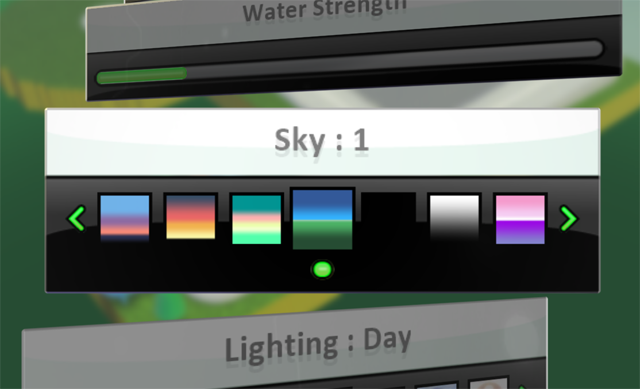

test 26

[Home](..)/[Tips](.)/Sky

Use the sky settings to control the color of the background of your game.  Use this to set the mood, control day and night, or compliment your game's location.

The sky control is found in the World Settings menu which is on the far right when you are editing your world.  

Scroll down to find the Sky Settings control and set the value you want. 

## See Also
[Lighting](lighting), [Start Game With](start)

## Questions?
For questions or any support issues, email <KoduSupport@InfiniteInstant.com>.
 

 

   

