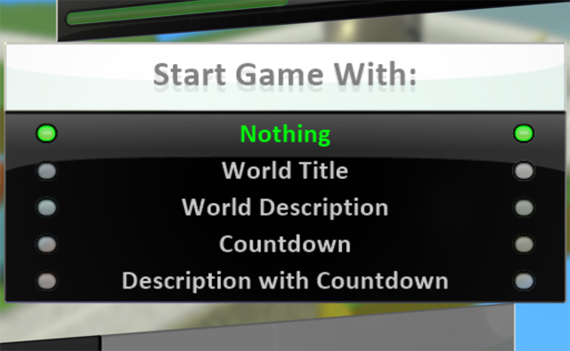

test 26

[Home](..)/[Tips](.)/Start Game With

## Start Game With...

The Start Game With option allows you to customize what is displayed when your game starts.  You can start with the title, the world description (as seen below), or even a countdown.  Using the description is a great way to give your players instructions that they need before playing.  The Countdown option is a must for racing games.

To set the start mode, first choose World Settings

and then scroll down to the Start Game With tile and make your choice.

## See Also
[Secret Glyph Codes](glyphs), [GUI Buttons](gui_buttons)

## Questions?
For questions or any support issues, email <KoduSupport@InfiniteInstant.com>.
 

 

   

